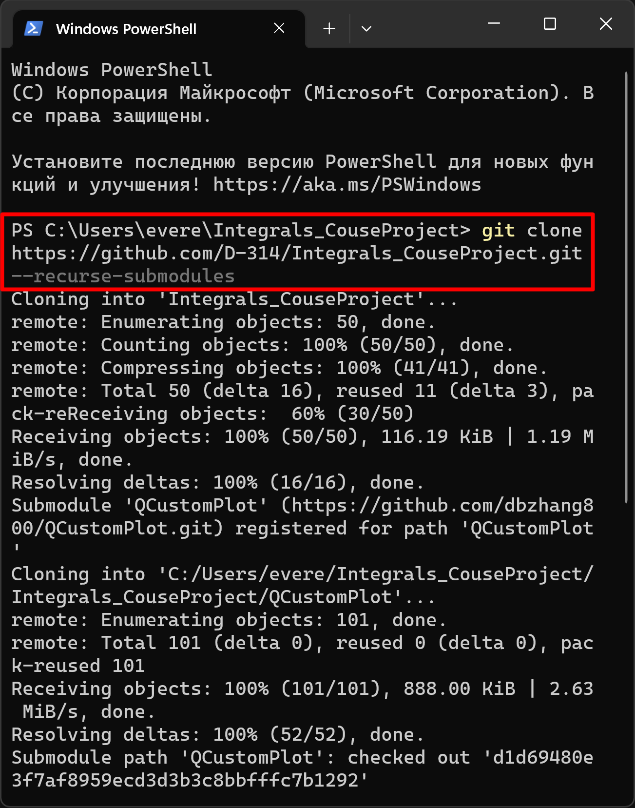
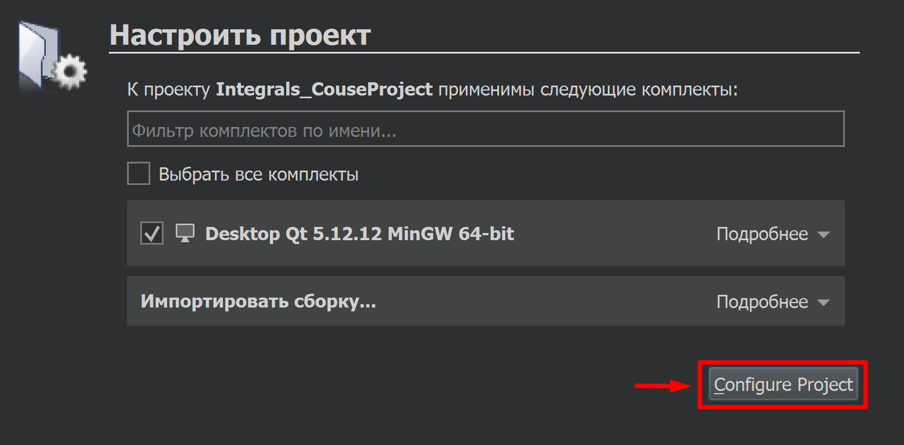
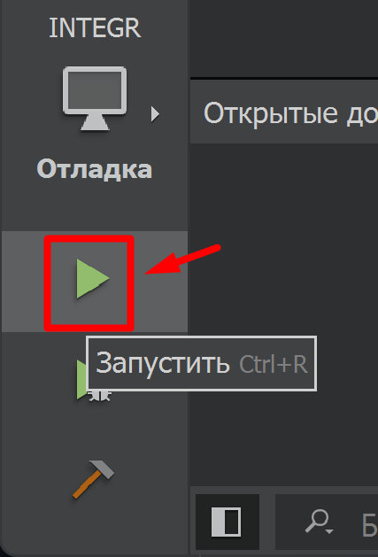
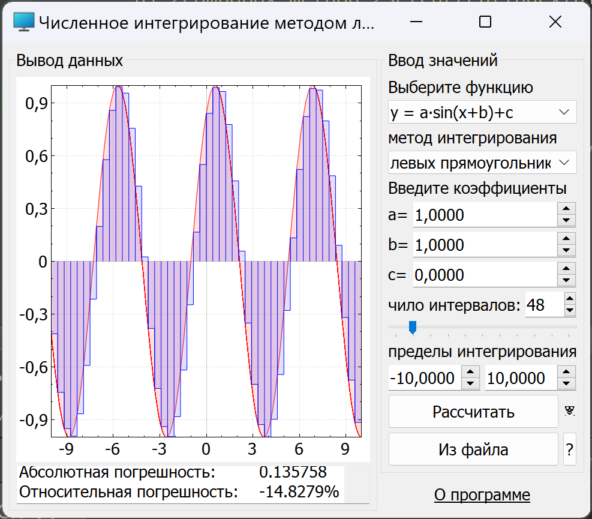
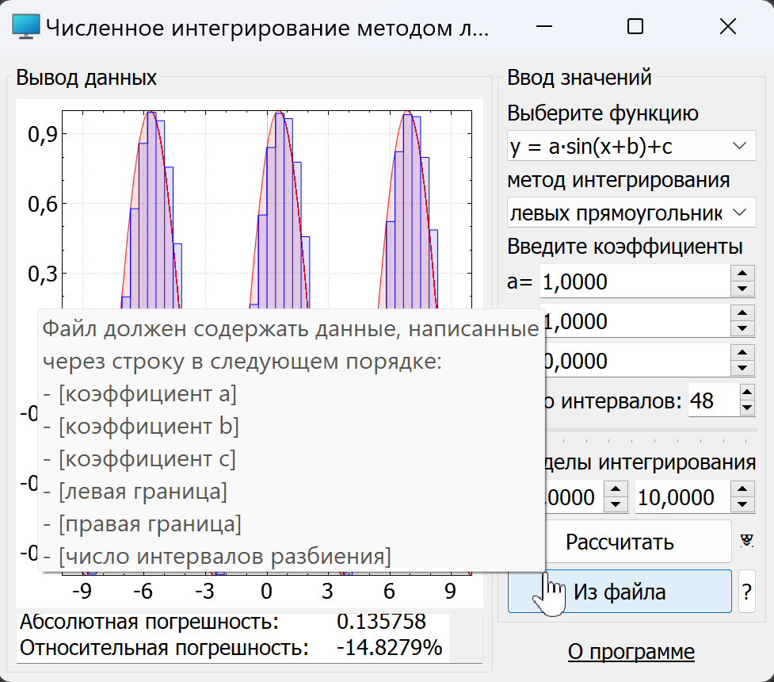

# Курсовой проект для первого курса бакалавриата по предмету "Информатика и вычислительная техника"

## 📦 Сборка

Для сборки проекта необходимо:
1. Клоноровать репозиторий c помощью команды: ```git clone https://github.com/D-314/Integrals_CouseProject.git --recurse-submodules```
2. Перейти в каталог *Integrals_CouseProject*, открыть файл *INTEGR.pro* в [QtCreator](https://download.qt.io/archive/qt/5.12/5.12.12/qt-opensource-windows-x86-5.12.12.exe)
3. Сконфигурировать проект
4. Запустить сборку

Коротко, в картинках:

<p align="center">
  
  
  
  
</p>
  
## 🔧 Использование

Для вычисления интеграла необходимо:
- выбрать функцию и метод интегрирования
- ввести вручную или загрузить из файла коэффициенты функций, число интервалов разбиения и пределы интегрирования
- нажать кнопку расчитать
<p align="center">
  
  
</p>

## 📋 Возможности

- вычисление интегралов несколькими методами:
	- левых прямоугольников
	- центральных прямоугольников
	- правых прямоугольников
	- трапеций
	- парабол
	- Симпсона 3/8
	- Буля
- расчёт абсолютной и относительной погрешностей
- использование функций вида:
	- a∙x³+b∙x+c (полином)
	- a∙sin(x+b)+c (синус)
	- a∙ln|x+b|+c (логарифм)
- построение интерактивных графиков функций
- визуальное отображение (геометрический смысл) вычисленного интеграла
- загрузка конфигурации из файла *config.txt* при запуске программы, со строками:
	1. метод интегрирования по умолчанию (при запуске)
	2. видимость выпадающего списка с методами интегрирования
		- не задано: скрыт
		- 0: отключено (отображается, но неактивен)
		- 1: отображается
	3. возможность снятия ограничений, предотвращающих нестабильную работу программы (не рекомендуется)
		- 0: не отображается
		- 1: отображается
	4. Отключение кнопки "О программе"
		- 0: активна
		- 1: неактивна
- импорт данных из текстового файла, содержащих следующие строки:
	1. коэффициент a
	2. коэффициент b
	3. коэффициент c
	4. левая граница
	5. правая граница
	6. число интервалов разбиения
- навигация по программе с использованием клавиатуры

